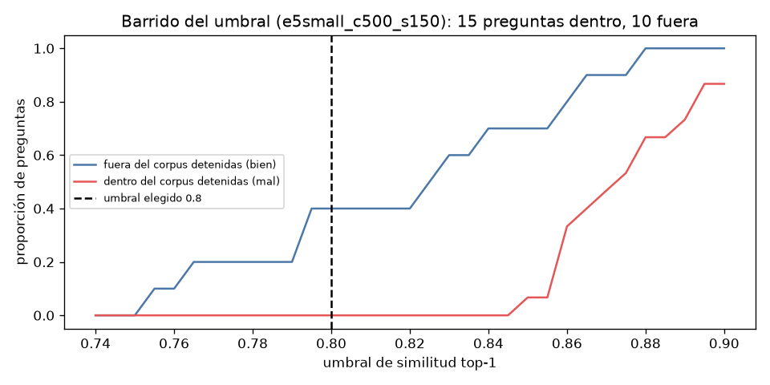

# Vender al Estado — Asistente normativo (Tarea 1) y Radar de compras (Tarea 2)

Proyecto para una MYPE peruana que quiere venderle al Estado:

- **Tarea 1 — RAG normativo** (`tarea1_rag_normativo/`): responde preguntas sobre la Ley N.° 32069 y el D.S. N.° 001-2026-EF citando documento y página, y se abstiene cuando la respuesta no está en el corpus.
- **Tarea 2 — Radar RAG** (`tarea2_radar/`): datos abiertos de contrataciones de OECE (OCDS) validados, ubicados en un mapa por departamento y consultables en lenguaje natural con filtros más búsqueda semántica.

El enunciado completo está en [docs/enunciado.md](docs/enunciado.md). Las notas para el video están en [docs/notas_para_video.md](docs/notas_para_video.md).

> Estado: en construcción. Cada fase agrega su sección a este README.

## Instalación en Windows (paso a paso)

Probado con **Python 3.14.7**. En Windows:

1. Instala Python desde https://www.python.org/downloads/windows/ y marca **"Add python.exe to PATH"** durante la instalación.
2. Abre **PowerShell** en la carpeta del proyecto:
   ```powershell
   git clone https://github.com/mmlis02/HW_03_202602.git
   cd HW_03_202602
   py -m venv .venv
   .venv\Scripts\Activate.ps1
   python -m pip install --upgrade pip
   ```
   Si PowerShell bloquea la activación, ejecuta una vez: `Set-ExecutionPolicy -Scope CurrentUser RemoteSigned`.
3. Instala **PyTorch solo CPU** primero; así no se descargan los paquetes de GPU, que pesan varios GB:
   ```powershell
   pip install torch --index-url https://download.pytorch.org/whl/cpu
   ```
4. Instala el resto:
   ```powershell
   pip install -r requirements.txt
   ```
5. Credenciales: copia `.env.example` como `.env` y pon tu clave de OpenAI:
   ```powershell
   copy .env.example .env
   notepad .env
   ```

6. (Recomendado) Activa la revisión automática que bloquea commits con claves de API o archivos `.env`:
   ```powershell
   git config core.hooksPath .githooks
   ```

En macOS/Linux los pasos son iguales, con `python3 -m venv .venv` y `source .venv/bin/activate`. El paso 3 no hace falta en Mac, porque la versión por defecto ya es solo CPU.

## Datos grandes fuera de git

Los PDFs originales, los archivos mensuales de OECE y los índices vectoriales **no se suben al repositorio**; ver `.gitignore`. Cada tarea tiene un script de descarga (`scripts/`) que los vuelve a bajar y que no repite lo que ya existe. Los detalles se agregarán en cada fase.

## Tarea 1 — Fase 1: fuentes, extracción y limpieza

### Corpus

| id | Documento | Institución y formato | Publicación | Rol |
|---|---|---|---|---|
| `ley32069` | Ley N.° 32069, Ley General de Contrataciones Públicas, **versión actualizada al 19/07/2026** | OECE en gob.pe (compilación basada en el SPIJ), PDF de texto corrido | ley: 24/06/2024; versión: 19/07/2026 | norma principal |
| `ds001_2026_ef` | Decreto Supremo N.° 001-2026-EF, que modifica el Reglamento de la Ley 32069 | MEF, publicado en El Peruano (PDF del diario, varias columnas) | 08/01/2026 | norma modificatoria (del Reglamento) |
| `dl1715` | Decreto Legislativo N.° 1715, que modifica el art. 85.1.e) de la Ley 32069 | Poder Ejecutivo, publicado en El Peruano | 04/02/2026 | **documento opcional**: norma modificatoria de la propia ley |

Las URLs exactas, la fecha de descarga (27/09/2026) y la huella sha256 de cada PDF están en [`tarea1_rag_normativo/config.yaml`](tarea1_rag_normativo/config.yaml) y en [`tarea1_rag_normativo/data/manifiesto_descargas.json`](tarea1_rag_normativo/data/manifiesto_descargas.json).

Para volver a descargarlos (no repite lo que ya existe):

```bash
cd tarea1_rag_normativo
python scripts/descargar_fuentes.py
```

### Verificación de fuentes (hecha antes de construir el resto)

```bash
python scripts/verificar_fuentes.py   # escribe data/processed/verificacion_fuentes.md y .csv
```

| Documento | Págs. PDF | Caracteres por página (mín / mediana / máx) | Págs. sin texto | Caracteres de otras normas recortados | Orden de lectura* | ¿Se puede usar? |
|---|---|---|---|---|---|---|
| `ley32069` (actualizada 19/07/2026) | 63 | 1.234 / 3.546 / 4.268 | ninguna | 0 | 99 % | **SÍ** |
| `ds001_2026_ef` | 16 | 6.446 / 6.980 / 8.093 | ninguna | 6.272 (pág. 16) | 98 % | **SÍ, recortando otras normas** |
| `dl1715` | 2 | 6.377 / 6.659 / 6.942 | ninguna | 6.039 (págs. 1–2) | revisión manual: correcto** | **SÍ, recortando otras normas** |
| `ley32069_original` (24/06/2024) — *revisada, no usada* | 36 | 390 / 6.451 / 6.923 | ninguna | 0 | 99 % | SÍ (descartada por la decisión de abajo) |

\* Porcentaje de veces que el siguiente "Artículo N." tiene un número mayor o igual al anterior. Los pocos saltos hacia atrás son citas a otros artículos.
\*\* El D.Leg. 1715 tiene solo 5 artículos, y uno es el "Artículo 85" de la ley que cita. Con tan pocos artículos, la medida no es confiable, así que el texto se leyó completo a mano.

**Hallazgo:** El Peruano imprime varias normas en la misma página. El PDF del D.S. 001-2026-EF trae en su página 16 la R.VM. N.° 001-2026-EF/15.01, y el del D.Leg. 1715 comparte páginas con el final de otra norma y con el D.Leg. 1716. **Regla:** cada norma de El Peruano termina con su código de publicación en una línea sola (por ejemplo `2474920-3`). Se recorta en ese código, y la regla está en `config.yaml` (`recorte`). Las páginas conservan su número original del PDF.

### ¿Por qué la versión actualizada de la ley y no el texto original? (opción B)

Se verificaron ambas y las dos son legibles. Se eligió la **versión actualizada al 19/07/2026** por tres razones:

1. **Es la versión vigente.** Desde 2024, la ley fue modificada por las Leyes 32103, 32187, 32515 y 32732 y por el D.Leg. 1715. Con el texto original, el asistente respondería con artículos que ya no rigen, que es justo el error de "texto original ya modificado" que pide evitar el enunciado.
2. **Es oficial.** La publica OECE, el organismo rector, en gob.pe, dentro de la colección de la Ley 32069 que enlaza el enunciado. No es una consolidación de un portal jurídico privado, que el enunciado no acepta.
3. **Marca cada cambio.** Junto a cada artículo modificado trae una nota "(\*) Literal modificado por el Artículo 3 del Decreto Legislativo N° 1715, publicada el 04 febrero 2026, cuyo texto es el siguiente: …". Eso permite decirle al usuario qué norma cambió el texto y desde cuándo.

**Riesgo conocido:** esta versión conserva el texto antiguo junto al nuevo. Se trata con la regla R7 (ver más abajo).

Sobre el D.Leg. 1715 como documento opcional: su contenido ya está incorporado en la versión actualizada, pero se incluye porque es la **norma modificatoria original**, con su propia fecha, finalidad y vigencia. Así se pueden hacer preguntas de versión ("¿qué norma agregó la infraestructura hidráulica y cuándo?") y citar la fuente primaria.

### Extracción y limpieza

```bash
python scripts/procesar_documentos.py
```

Salidas en `tarea1_rag_normativo/data/processed/`:

| Archivo | Contenido |
|---|---|
| `<id>.jsonl` | una línea por página: `documento`, `pagina` (número de página del PDF) y `texto` limpio |
| `reporte_calidad_extraccion.md` / `.json` | páginas, caracteres, páginas descartadas y por qué, reglas aplicadas y una muestra de la mitad de cada documento |
| `ejemplos_limpieza.md` | ejemplos **antes/después** de cada regla |
| `versiones_ley32069.json` | cada nota "(\*)" de la ley: qué texto antiguo se quitó y qué texto quedó vigente |

**Cómo se conserva la página desde el primer paso.** `src/extraccion.py` lee el PDF **página por página** y cada texto sale como `{"pagina": n, "texto": ...}`. El recorte de otras normas, la limpieza y la división en párrafos trabajan siempre sobre esa lista. Un párrafo que cruza de una página a otra se deja partido en dos, uno por página. Nunca se une el documento entero en un solo texto.

Si se unieran todas las páginas en un solo string para cortarlo después, los cortes ya no coincidirían con los saltos de página. Habría que adivinar la página de cada fragmento contando caracteres, y cualquier cambio de longitud durante la limpieza (quitar encabezados o notas) desplaza esa cuenta. El resultado serían citas a páginas equivocadas.

**Reglas de limpieza** (patrones en `config.yaml > limpieza`, código en `src/limpieza.py`):

| Regla | Qué quita o corrige | ley32069 | ds001_2026_ef | dl1715 |
|---|---|---|---|---|
| Recorte | texto de otras normas en la misma página de El Peruano (por código de publicación) | 0 | 6.272 chars | 6.039 chars |
| R1 | encabezado de página de El Peruano (n.° de página, "NORMAS LEGALES", fecha, "El Peruano /") | 0 | 16 | 1 |
| R2 | sello "Firmado por: Editora Peru / Fecha: …" | 0 | 1 | 1 |
| R3 | código de publicación que cierra la norma (`2474920-3`) | 0 | 1 | 1 |
| R4 | ligaduras rotas ("Califi cación" → "Calificación") | 0 | 0 | 0 |
| R5 | párrafos "CONCORDANCIAS:" del SPIJ | 1 | 0 | 0 |
| R6 | re-armado de líneas cortadas por el ancho de columna, incluidas líneas de una sola palabra | todas | todas | todas |
| R7 | notas de versión "(\*)" (ver abajo) | 20 notas | — | — |

R4 no se aplica en el corpus final. Se escribió para el texto original de la ley, que tenía 411 ligaduras rotas, y se deja activa por si se agrega otro PDF de El Peruano. Los ejemplos antes/después están en [`ejemplos_limpieza.md`](tarea1_rag_normativo/data/processed/ejemplos_limpieza.md). Un ejemplo de R1 + R6:

```text
ANTES:  36\nNORMAS LEGALES\nJueves 8 de enero de 2026\n El Peruano \n/\n“Artículo 72. Requisitos de calificación\n(…)\n72.2. Los evaluadores revisan los requisitos de \ncalificación de las ofertas que sean admitidas. En el \ncaso de ...
DESPUÉS: “Artículo 72. Requisitos de calificación

         (…)

         72.2. Los evaluadores revisan los requisitos de calificación de las ofertas que sean admitidas. En el caso de ...
```

### Versiones: cómo se evita responder con el texto antiguo (capa 1 de 4)

La versión actualizada trae, por ejemplo, el literal 85.1.e) **antiguo** terminado en "(\*)", seguido de "(\*) Literal modificado por el Artículo 3 del Decreto Legislativo N° 1715, publicada el 04 febrero 2026, cuyo texto es el siguiente: "e) … infraestructura hidráulica …"". La regla R7 recorre las 20 notas de la ley. El PDF tiene 37 marcas "(\*)": 20 empiezan una nota y 17 son marcas de llamada pegadas al final del texto al que se refiere la nota.

| Tipo de nota | Casos | Qué se hace |
|---|---|---|
| modificado | 12 | se **borra del índice** el texto antiguo (desde el párrafo que empieza con la misma etiqueta que el texto nuevo, p. ej. `e)`, `41.1`, `VIGÉSIMA NOVENA.`, hasta la marca "(\*)") y queda `[Texto vigente — Literal modificado por …, publicada el …] "e) …"` |
| incorporado | 2 | el texto ya es el nuevo; se agrega `[Literal incorporado por …]` |
| derogado | 1 | se borra el numeral 67.8 y queda `[Numeral 67.8 derogado por la … Ley N° 32103 …]` |
| "De conformidad con…" | 4 | aviso de vigencia; se conserva como `[Nota de vigencia] …` |
| fe de erratas SPIJ | 1 | se corrige "vretirado" → "retirado" en el art. 94 k) |

Tres notas empezaban al final de una página y seguían en la siguiente. Se unen, y el texto vigente se cita con la página donde realmente está. Las 12 modificaciones ubicaron su texto antiguo (0 casos sin resolver) y no quedan marcas "(\*)" en el texto limpio. El detalle de cada caso está en `versiones_ley32069.json`.

Las otras tres capas se implementan en las fases 2–4: metadatos `modificado_por`/fecha en cada fragmento, instrucciones en el prompt y preguntas de evaluación sobre artículos modificados.

## Tarea 1 — Fase 2: fragmentos, embeddings e índice

```bash
cd tarea1_rag_normativo
python build_index.py                         # PROCESO OFFLINE: índice principal (c500_s150, modelo local)
python build_index.py --fragmentos todas      # las 5 configuraciones, para compararlas
python eval/evaluar_recuperacion.py --fragmentos todas   # Recall@k sin llamar al LLM (costo 0)
python scripts/reporte_fragmentos.py          # tablas y gráfico de la Fase 2
python scripts/probar_indice.py               # demuestra idempotencia, reanudación y aislamiento
```

`build_index.py` lee `data/processed/*.jsonl`, **nunca los PDFs**. El índice queda en `data/index/chroma/` (48 MB con las 5 configuraciones, fuera de git) y se regenera con ese comando.

### Set de evaluación

[`eval/preguntas.csv`](tarea1_rag_normativo/eval/preguntas.csv) tiene 25 preguntas:

- **15 dentro del corpus.** 6 están en estilo "dueño de MYPE", redactadas por la autora. 5 son sobre normas modificatorias del corpus (D.Leg. 1715 y D.S. 001-2026-EF) y 2 sobre artículos modificados por la Ley 32187.
- **10 fuera del corpus.** 4 son cercanas: 3 del Reglamento no modificado por el D.S. (arts. 90, 108, 120 y 144, todos fuera de la lista de artículos que modifica el decreto) y 1 de otra ley (REMYPE). El resto son claramente ajenas.

La página esperada de cada pregunta se verificó **leyendo el texto procesado**, no con el buscador; la columna `evidencia` tiene la cita. Una pregunta puede aceptar varias páginas válidas, por ejemplo D08 = `ley32069:43;dl1715:1,2`, y el evaluador acepta cualquiera.

### Modelo de embeddings local

| | `intfloat/multilingual-e5-small` |
|---|---|
| Prefijos | la ficha del modelo exige `"query: "` para preguntas y `"passage: "` para fragmentos (en `config.yaml`) |
| Límite de entrada | **512 tokens**; lo que pasa se trunca |
| Dimensión | 384 |
| Tamaño en disco | 471 MB (solo `model.safetensors` + tokenizador) |
| Dispositivo | CPU |

Cada fragmento se convierte en embedding como `passage: <nombre corto del documento> — <Artículo N o Disposición X>\n<texto>`. El encabezado ayuda a distinguir la ley del decreto; el texto citado no cambia.

**Relación con el límite:** con la configuración elegida, el fragmento más largo ocupa **204 tokens**, el 40 % del límite, y **ningún fragmento se trunca**. La c1800 llega a 508 tokens, al borde del límite.

### Elección del tamaño y del solapamiento (con evidencia)

**Unidades:** tamaño y solapamiento se miden en **caracteres**, no en tokens. En este corpus, 500 caracteres ≈ 120 tokens de e5-small.

Se compararon **5 configuraciones** en dos pasos:
1. **Tamaño**, con solapamiento ≈ 15 %: 500, 1000 y 1800 caracteres.
2. **Solapamiento**, con el tamaño de 500 fijo: 0, 75 y 150 caracteres.

| Config. | Tamaño / solape (chars) | Fragmentos | Recall@1 | Recall@3 | Recall@5 | MRR@5 | AUC dentro/fuera* | Tokens mediana / máx. |
|---|---|---|---|---|---|---|---|---|
| c500_s0 | 500 / 0 | 852 | 0.73 | 0.80 | 0.80 | 0.77 | 0.907 | 113 / 164 |
| c500 | 500 / 75 | 942 | 0.80 | 0.80 | 0.87 | 0.82 | **0.940** | 116 / 183 |
| **c500_s150 ✅** | 500 / 150 | 1039 | **0.80** | **0.87** | **0.93** | **0.85** | 0.887 | 121 / 204 |
| c1000 | 1000 / 150 | 472 | 0.73 | 0.80 | 0.80 | 0.77 | 0.937 | 207 / 302 |
| c1800 | 1800 / 250 | 255 | 0.67 | 0.87 | **0.93** | 0.77 | 0.930 | 360 / 508 |

\* AUC = probabilidad de que una pregunta dentro del corpus tenga mayor similitud top-1 que una de fuera.

**Advertencia honesta sobre el tamaño de la muestra.** Hay 15 preguntas dentro del corpus, así que **cada pregunta vale 6,7 puntos porcentuales**:
- Entre 500 (solape 75) y 1000 la diferencia es de **una pregunta** en cada métrica: 12 frente a 11 en Recall@1 y 13 frente a 12 en Recall@5.
- La 1800 **gana en Recall@5** (14 de 15, empatada con la elegida), pero es la peor en Recall@1 (10 de 15).

Ninguna diferencia individual es estadísticamente sólida. Por eso la decisión combina varios criterios, no una sola métrica.

**Decisión: 500 caracteres con solapamiento 150 (c500_s150).**

| Criterio | Por qué importa | Resultado |
|---|---|---|
| Recall@5 | el motor entrega 5 fragmentos al LLM: si la página correcta no está entre ellos, no hay buena respuesta | 0.93, empatada con la mejor (c1800) |
| Recall@1 / MRR | la fuente más relevante sale primero, lo que se ve mejor en la interfaz y ayuda al LLM | 0.80 (empatada con la mejor) / **0.85 (la mejor)** |
| Umbral en el punto de trabajo | con la regla inicial del umbral ("justo bajo la legítima más baja"), cuántas preguntas fuera detiene sin detener legítimas; el umbral final se revisó en la Fase 3 | **7/10** con 0 errores (c500 y c1800: 6/10) |
| AUC global | separación general dentro/fuera | 0.887, **la más baja**: el solapamiento sube el puntaje de las 3 trampas que ningún umbral puede detener igual (ver Fase 3); en el punto de trabajo sí detiene más |
| Margen frente a 512 tokens | ningún fragmento se trunca | máx. 204 tokens (40 %) |
| Precisión de la cita | fragmentos chicos = el usuario ve exactamente el párrafo que responde | ~440 chars por fragmento |
| Costo por pregunta | 5 fragmentos al LLM | ≈ 1.100 tokens de entrada, medido con `evaluar_motor.py --estimar` (los fragmentos de c1800 son ~3 veces más largos) |

El solapamiento ayuda porque en la ley muchos numerales cortos van seguidos. Sin solape (c500_s0), un numeral partido entre dos fragmentos pierde su contexto y la recuperación empeora (0.80 en Recall@5).

> Nota de proceso: la primera versión de este README elegía c500 (solape 75). Al corregir la detección de encabezados de disposiciones (los fragmentos de las disposiciones finales heredaban el "Artículo N" anterior) se recalculó todo, y la c500_s150 subió de 0.73 a 0.80 en Recall@1. Con los números nuevos pasó a ser la mejor, y se cambió.

### Fragmentos por documento y distribución de longitudes (c500_s150)

| Documento | Fragmentos |
|---|---|
| ley32069 | 686 |
| ds001_2026_ef | 331 |
| dl1715 | 22 |
| **Total** | **1.039** |

Largo en caracteres: mín. 65 / mediana 439 / p90 639 / máx. 650. En tokens: 40 / 121 / 159 / 204. El máximo en caracteres pasa de 500 por el solape de 150 y porque no se parten párrafos cortos. El detalle y el gráfico de las 5 configuraciones están en [`reporte_fragmentos.md`](tarea1_rag_normativo/data/processed/reporte_fragmentos.md).

### Metadatos de cada fragmento

`documento`, `titulo`, `tipo`, `version`, `fecha_version`, **`pagina`**, `modifica` (qué norma modifica ese documento), `articulo` (artículo o disposición en que empieza el fragmento), `articulos_en_fragmento`, **`modificado_por`** y `fecha_modificacion` (tomados de la etiqueta `[Texto vigente — …]`; es la capa 2 de versiones), `chars` y `hash`.

### IDs, idempotencia, reanudación y aislamiento

- **ID** = `<documento>:p<página>:c<n.º>`, por ejemplo `dl1715:p1:c3`. Es único entre documentos porque empieza con el id del documento, y estable porque depende solo del texto procesado y de la configuración.
- **Idempotente:** se guarda con `upsert`, y antes de calcular embeddings se compara una **huella (hash)**. La huella cubre el texto, el encabezado del embedding y todos los metadatos. Si nada cambió, el fragmento se salta; si cambió cualquier cosa, incluidos los metadatos, se recalcula.
- **Reanudable:** se guarda por lotes de 64. Si el proceso se corta, lo guardado queda y la siguiente corrida solo hace lo que falta.
- **Aislado por documento:** al indexar un documento solo se leen y borran fragmentos con `documento == <ese id>`, así que agregar o cambiar un documento no toca a los otros.

Evidencia (`logs/prueba_indice.log`, colección temporal):

```text
[reanudable] tras el 'corte': 343 de 686 fragmentos de la ley
[reanudable] segunda corrida: ya_estaban=343, insertados=343, total=686
[aislado] dl1715 agregado (22 fragmentos); fragmentos de la ley sin cambios: True (686 IDs)
[idempotente] reindexar todo otra vez: total antes=708, después=708
[IDs] únicos: True (1039 IDs); idénticos al volver a fragmentar: True
```

**¿Por qué ChromaDB?** Es persistente en disco sin servidor aparte, guarda juntos el vector, el texto y los metadatos (página, documento, `modificado_por`), permite filtrar por metadatos (se usa para el aislamiento por documento y se reutilizará en la Tarea 2 para filtrar por departamento y monto) y se instala con `pip`, también en Windows. FAISS obligaría a guardar los metadatos aparte.

## Tarea 1 — Fase 3: motor RAG, umbral, versiones y alcance

```bash
cd tarea1_rag_normativo
python preguntar.py "¿En cuántos días me tienen que pagar?"   # interfaz de línea de comandos
python eval/barrido_umbral.py              # barrido del umbral (sin IA, costo 0)
python eval/evaluar_motor.py               # abstención por UMBRAL (sin IA, costo 0)
python eval/evaluar_motor.py --estimar     # estima el costo de la corrida con IA
python eval/evaluar_motor.py --con-ia      # abstención FINAL (con IA) con el umbral de config.yaml — cuesta dinero
python eval/evaluar_motor.py --con-ia --sin-umbral --etiqueta prompt_v2   # diagnóstico: el LLM ve las 25 — cuesta dinero
python eval/opciones_umbral.py --etiqueta prompt_v2   # compara umbrales con AMBAS abstenciones (sin nuevas llamadas)
python scripts/probar_motor_sin_costo.py   # prueba todos los caminos del motor con un LLM falso
```

### Arquitectura: un motor, varias interfaces

- **Offline** (`build_index.py`): PDF → texto por página → limpieza → fragmentos → embeddings → ChromaDB. Se corre una vez.
- **Online** (`src/motor.py`): una sola función `responder(pregunta) -> dict`. La app Streamlit (Fase 5) y `preguntar.py` **solo llaman a esa función**. El motor abre el índice en modo lectura (`get_collection`: si no existe, falla en vez de reconstruirlo) y **nunca lee los PDFs**.
- **Resultado estructurado:** `respuesta`, `abstuvo` (booleano), `motivo_abstencion` (`umbral` / `fuera_de_corpus` / `sin_citas`), `explicacion_limite`, `respuesta_parcial` (booleano), `fuentes` (documento, título, página, similitud, artículo, `modificado_por`, texto, `citada`), `similitud_max`, `umbral`, `notas_version`, `llamo_llm`, `modelo`, `tokens_entrada`, `tokens_salida`, `costo_usd`, `latencia_s` y **`error`**.
- **El motor no conoce interfaces.** Verificación:
  ```bash
  grep -nE "^\s*(import|from)\s+(streamlit|telegram|gradio|flask|tkinter)" tarea1_rag_normativo/src/*.py || echo "OK: ninguna librería de interfaz en src/"
  ```
  Resultado: `OK: ninguna librería de interfaz en src/`.

### Dos defensas contra responder mal

**Defensa 1: umbral, SIN IA (costo 0).** Si la similitud del mejor fragmento es menor que `umbral_similitud` (**0.800**), el motor se abstiene **antes** de llamar al LLM.

**Defensa 2: el LLM, con esquema JSON estricto.** El LLM devuelve `{"fuera_de_corpus": bool, "respuesta": str, "explicacion_limite": str}`. El prompt le prohíbe usar conocimiento propio y le exige marcar `fuera_de_corpus` cuando los fragmentos **no contienen el dato central** que se pregunta, aunque mencionen el tema, como "en porcentaje mayor al permitido por el reglamento". Si responde solo en parte, debe declarar lo que falta en `explicacion_limite`. La abstención es un **campo booleano del resultado**, nunca se deduce comparando el texto.

**Por qué hacen falta las dos.** Similitud top-1 de las 25 preguntas ([`puntajes_top1_e5small_c500_s150.md`](tarea1_rag_normativo/eval/resultados/puntajes_top1_e5small_c500_s150.md)):

| # | id | Tipo | Similitud top-1 | Pregunta | Defensa 1 (umbral 0.800) |
|---|---|---|---|---|---|
| 1 | D14 | dentro | 0.9245 | ¿Cuándo se declara desierto un procedimiento de selección? | pasa ✅ |
| 2 | D07 | dentro | 0.9043 | ¿Pueden las micro y pequeñas empresas emitir facturas negociables al contratar con el Estado y por qué plazo máximo? | pasa ✅ |
| 3 | D10 | dentro | 0.8935 | Según la modificación del Reglamento, ¿quién revisa los requisitos de calificación en los procedimientos evaluados por jurados? | pasa ✅ |
| 4 | D08 | dentro | 0.8931 | ¿Procede una medida cautelar para paralizar la ejecución de una obra de infraestructura hidráulica? | pasa ✅ |
| 5 | D09 | dentro | 0.8880 | ¿Qué norma incorporó la infraestructura hidráulica entre las obras en que no proceden medidas cautelares, y con qué finalidad? | pasa ✅ |
| 6 | D15 | dentro | 0.8794 | ¿Qué contracautela puede ofrecer una micro o pequeña empresa que solicita una medida cautelar? | pasa ✅ |
| 7 | F06 | fuera | 0.8787 | Me dieron la buena pro, ¿en cuántos días tengo que presentar los papeles para firmar el contrato? | **pasa → defensa 2 (IA)** |
| 8 | D03 | dentro | 0.8755 | Ya entregué todo y me dieron el visto bueno, ¿cuánto se pueden demorar en pagarme? | pasa ✅ |
| 9 | D12 | dentro | 0.8730 | ¿Qué formación mínima se exige para certificarse como comprador público? | pasa ✅ |
| 10 | D05 | dentro | 0.8651 | Perdí una licitación y creo que fue injusto. Si soy pequeña empresa, ¿cuánta plata tengo que dejar para reclamar? | pasa ✅ |
| 11 | D11 | dentro | 0.8625 | ¿Cuál es el tope de penalidades en un contrato menor? | pasa ✅ |
| 12 | F02 | fuera | 0.8601 | ¿Cómo se calcula la penalidad diaria por mora en un contrato de bienes? | **pasa → defensa 2 (IA)** |
| 13 | D06 | dentro | 0.8584 | ¿El Estado me puede dar parte del pago por adelantado para comprar los materiales? ¿Cuánto como máximo? | pasa ✅ |
| 14 | D02 | dentro | 0.8579 | Si una municipalidad quiere comprarme algo chiquito, de unos 3 mil soles, ¿igual tiene que hacer licitación? | pasa ✅ |
| 15 | F03 | fuera | 0.8575 | Ya entregué los productos, ¿cuántos días tienen para revisarlos y darme el ok? | **pasa → defensa 2 (IA)** |
| 16 | D13 | dentro | 0.8568 | ¿Qué es la Pladicop? | pasa ✅ |
| 17 | D04 | dentro | 0.8562 | La entidad se está atrasando con mi pago, ¿puedo cobrarles algo extra por la demora? | pasa ✅ |
| 18 | D01 | dentro | 0.8450 | Recién formalicé mi negocio, ¿qué trámite tengo que hacer para poder venderle al Estado? | pasa ✅ |
| 19 | F01 | fuera | 0.8393 | ¿Puedo pasarle parte del trabajo a otra empresa? ¿Hasta cuánto? | **pasa → defensa 2 (IA)** |
| 20 | F07 | fuera | 0.8264 | ¿Cómo inscribo mi empresa en el REMYPE y qué beneficios tengo? | **pasa → defensa 2 (IA)** |
| 21 | F04 | fuera | 0.8238 | ¿Cómo saco mi RUC en la SUNAT para mi negocio? | **pasa → defensa 2 (IA)** |
| 22 | F09 | fuera | 0.7945 | ¿Cada cuántos kilómetros hay que cambiarle el aceite al carro? | detenida ✅ |
| 23 | F05 | fuera | 0.7922 | ¿Cómo se prepara un ceviche? | detenida ✅ |
| 24 | F10 | fuera | 0.7639 | ¿Qué equipo ganó la Copa América 2024? | detenida ✅ |
| 25 | F08 | fuera | 0.7540 | ¿Cuál es la capital de Australia? | detenida ✅ |

**Hallazgo:** 3 preguntas del Reglamento (F06, F02, F03) tienen **más similitud que preguntas legítimas**; por ejemplo, F06 = 0.8787 frente a D01 = 0.8450. El texto que recuperan es real y del mismo tema: el D.S. cita "el plazo previsto en el numeral 90.1" y habla de penalidades y conformidad, pero sin la respuesta. **Ningún umbral puede detenerlas sin detener también preguntas legítimas.** El umbral detiene gratis lo claramente ajeno; lo cercano lo detiene la defensa 2.

### Qué cuenta como acierto (regla fijada ANTES de la corrida con prompt v2)

Esta regla se escribió y se subió al repositorio **antes** de ejecutar la corrida con el prompt v2, para no acomodarla a los resultados. Se puede comprobar con la fecha del commit.

1. **Solo cuenta el campo estructurado `abstuvo`.** Nunca se interpreta el texto de la respuesta.
2. **Pregunta fuera del corpus:** es **abstención correcta** solo si `abstuvo = True`, por umbral (`motivo_abstencion = "umbral"`) o por la IA (`"fuera_de_corpus"` o `"sin_citas"`).
   - Si el sistema devuelve una **respuesta parcial** (`abstuvo = False`, `respuesta_parcial = True`), cuenta como **FALLO**, **aunque** su `explicacion_limite` diga que el dato central falta y está en el Reglamento.
   - Motivo: la interfaz muestra eso como una respuesta, y quien lee solo la primera línea se lleva información que no responde su pregunta. El prompt exige `fuera_de_corpus = true` cuando falta el dato central, así que una respuesta parcial en ese caso es un error del modelo, no un matiz.
3. **Pregunta dentro del corpus:** `abstuvo = True` es **abstención incorrecta**. Una respuesta parcial cuenta como **respondida**; si es buena o no se mide aparte con el acierto de cita.
4. **Acierto de cita** (solo preguntas dentro del corpus respondidas): al menos una de las páginas citadas está entre las páginas esperadas de la pregunta.
5. **Errores de API:** se reportan aparte y no cuentan como abstención.

El campo `respuesta_parcial` (booleano) del resultado del motor es `True` cuando el sistema respondió y además declaró en `explicacion_limite` qué parte no está en el corpus.

### Resultados con IA: prompt v1 frente a prompt v2

| | Prompt v1 (umbral 0.840) | Prompt v2 (umbral 0.840)* | **Prompt v2 (umbral 0.800) ✅** |
|---|---|---|---|
| Abstención por umbral (sin IA): correctas / incorrectas | 7/10 / 0/15 | 7/10 / 0/15 | **4/10 / 0/15** |
| **Abstención final (con IA): correctas / incorrectas** | 10/10 / **4/15** (D01, D02, D06, D12) | 10/10 / **2/15** (D02, D12) | **10/10 / 2/15** (D02, D12) |
| Acierto de cita (respondidas dentro del corpus) | 10/11 (D13 citó la pág. 60, no la 21) | 13/13 | 13/13 |
| Respuestas parciales (`respuesta_parcial = True`) | — (campo aún no existía) | 10 de 13 respondidas | 10 de 13 respondidas |
| Preguntas fuera respondidas por error | ninguna | ninguna | ninguna |
| Llamadas al LLM en la evaluación | 18 | 18 | 21 |
| Errores de API | 0 | 0 | 0 |

\* Las columnas de v2 se obtienen de **una sola corrida diagnóstica** en la que el LLM vio las 25 preguntas (25 llamadas, US$0.0042). Para cada umbral, la abstención final es "similitud < umbral **o** el LLM se abstuvo". El LLM no es determinista, así que una nueva corrida podría variar en algún caso.

**Qué cambió de v1 a v2.** En v1, D01, D06 y D12 tenían la **página** correcta en primer lugar y aun así el LLM se abstuvo: la regla del prompt ("abstente si solo menciona el tema") era tan amplia que lo hacía abstenerse por cualquier detalle faltante. v2 distingue entre "falta el **dato central**" (abstenerse) y "faltan detalles secundarios" (responder y declarar el límite). Resultado: se recuperaron D01 y D06 sin dejar pasar ninguna trampa.

> ⚠️ **Posible sobreajuste.** El prompt v2 se ajustó **mirando los fallos de estas mismas 25 preguntas de evaluación**. Por eso la mejora de 4/15 a 2/15 abstenciones incorrectas es optimista: no hay un conjunto de prueba separado que la confirme. Una evaluación honesta necesitaría preguntas nuevas, redactadas sin ver los resultados. Queda como trabajo futuro.

### Calibración del umbral: barrido y opciones con ambas abstenciones



Umbrales candidatos con el prompt v2 ([`opciones_umbral_prompt_v2.md`](tarea1_rag_normativo/eval/resultados/opciones_umbral_prompt_v2.md)):

| Umbral | Margen sobre la legítima más baja | Umbral (sin IA): correctas / incorrectas | Final (con IA): correctas / incorrectas | Fuera respondidas por error | Dentro perdidas | Llamadas al LLM (de 25) |
|---|---|---|---|---|---|---|
| 0.78 | +0.0650 | 2/10 / 0/15 | 10/10 / 2/15 | ninguna | D02 D12 | 23 |
| **0.80 ✅** | +0.0450 | 4/10 / 0/15 | 10/10 / 2/15 | ninguna | D02 D12 | 21 |
| 0.82 | +0.0250 | 4/10 / 0/15 | 10/10 / 2/15 | ninguna | D02 D12 | 21 |
| 0.83 | +0.0150 | 6/10 / 0/15 | 10/10 / 2/15 | ninguna | D02 D12 | 19 |
| 0.84 | +0.0050 | 7/10 / 0/15 | 10/10 / 2/15 | ninguna | D02 D12 | 18 |

**Decisión: 0.800** (antes era 0.840). Con el prompt v2 **todas las opciones dan la misma abstención final** (10/10 correctas, 2/15 incorrectas), porque el LLM detiene todo lo que el umbral deja pasar. Lo que cambia entre opciones es:

- **Margen para la demo en vivo.** Con 0.840 había solo 0.005 de margen sobre la pregunta legítima más baja (D01 = 0.8450): una pregunta redactada distinto podía quedar bloqueada sin razón. Con 0.800 el margen es **0.045**, nueve veces mayor.
- **Qué se detiene gratis y sin IA.** 0.800 sigue deteniendo sin IA las 4 preguntas claramente ajenas: capital de Australia, Copa América, aceite del carro y **ceviche (0.7922)**, el ejemplo del enunciado.
  - 0.82 detiene exactamente las mismas 4 con menos margen, así que 0.80 es mejor en todo.
  - 0.78 deja pasar el ceviche a la IA.
- **Costo y dependencia de la IA.** Bajar de 0.84 a 0.80 agrega 3 llamadas por cada 25 preguntas, unos US$0,0005, y deja la RUC, el REMYPE y la subcontratación en manos de la defensa 2. En la corrida las atrapó todas, pero el LLM no es determinista.

**Trade-off entre responder mal y no responder.** Un umbral alto evita llamadas, pero bloquea preguntas legítimas redactadas de forma distinta. Un umbral bajo pone todo el peso en la IA. Se eligió el punto en que el umbral **nunca** bloquea una pregunta legítima del set, con margen amplio, y aun así filtra gratis lo que está claramente fuera del dominio.

### Versiones (capas 2, 3 y 4) — ejemplo real

1. **Capa 1 (Fase 1):** el texto antiguo de la ley se borra del índice; solo queda el texto vigente etiquetado.
2. **Capa 2 (metadatos):** cada fragmento con `[Texto vigente — …]` lleva `modificado_por` y `fecha_modificacion`.
3. **Capa 3 (nota explícita, determinista):** el motor agrega `notas_version` **a partir de los metadatos de las fuentes citadas**, no del texto del LLM:
   - fragmento modificado → "Texto vigente: modificado por…";
   - fuente del D.S. 001-2026-EF → aviso de que solo trae algunos artículos del Reglamento;
   - fuente del D.Leg. 1715 → aviso de que es la norma modificatoria.
4. **Capa 4 (prompt + evaluación):** el prompt exige usar el texto vigente y nombrar la norma modificatoria. D05 y D08–D13 evalúan artículos modificados.

**Ejemplo real (D08, prompt v2):**

> **Pregunta:** ¿Procede una medida cautelar para paralizar la ejecución de una obra de infraestructura hidráulica?
>
> **Respuesta:** No. No proceden las medidas cautelares destinadas a impedir, paralizar o retrasar el inicio o la continuidad de la ejecución de obras de infraestructura hidráulica (Ley 32069 actualizada, pág. 43). Esta regla fue incorporada por el Decreto Legislativo N.° 1715, publicado el 4 de febrero de 2026 (Ley 32069 actualizada, pág. 43).
>
> **Nota de versión:** Texto vigente: modificado por el Artículo 3 del Decreto Legislativo N° 1715, publicada el 04 febrero 2026.

**Ejemplo real de modificación del Reglamento (D06, respuesta parcial):**

> **Respuesta:** Sí. La entidad puede darte un adelanto para materiales e insumos, equipamiento y mobiliario, si así se establece y fundamenta en la estrategia de contratación (Ley 32069 actualizada, pág. 32). El 30 % máximo mencionado en la Ley corresponde a los adelantos directos, no al adelanto para materiales (Ley 32069 actualizada, pág. 32).
>
> **Límite del corpus:** Los fragmentos no indican el porcentaje máximo del adelanto para materiales. El Reglamento modificado señala que se otorga progresivamente y según los porcentajes definidos en las bases, pero no precisa aquí un tope (D.S. 001-2026-EF, pág. 7).
>
> **Nota de versión:** El D.S. N.° 001-2026-EF modifica solo algunos artículos del Reglamento de la Ley N.° 32069 (D.S. N.° 009-2025-EF). El Reglamento completo no está en el corpus: esta respuesta muestra únicamente el texto modificado, no el artículo completo del Reglamento.

### Límites del corpus — ejemplos reales

Cuando la respuesta está en el Reglamento (no indexado), el sistema **se abstiene** (`abstuvo = True`, `motivo_abstencion = "fuera_de_corpus"`) y explica el límite:

> **F06:** Me dieron la buena pro, ¿en cuántos días tengo que presentar los papeles para firmar el contrato? (Reglamento, art. 90.1)
>
> **Respuesta:** Tu pregunta está relacionada con contrataciones públicas, pero la respuesta no está en los documentos indexados.
>
> **Límite del corpus:** El corpus menciona el consentimiento de la buena pro y, en otro contexto, un plazo de hasta veintidós días desde la suscripción del contrato para entregar documentos; ese plazo es posterior a la firma y no responde cuánto tiempo tienes para presentar los papeles para firmar.

> **F01:** ¿Puedo pasarle parte del trabajo a otra empresa? ¿Hasta cuánto? (Reglamento, art. 108)
>
> **Respuesta:** Tu pregunta está relacionada con contrataciones públicas, pero la respuesta no está en los documentos indexados.
>
> **Límite del corpus:** Aunque la pregunta se refiere a subcontratar parte de la prestación, los fragmentos entregados tratan otros temas y no contienen la regla, el porcentaje máximo ni las condiciones aplicables.

Y cuando el corpus responde solo en parte, el sistema **responde** y declara lo que falta (`respuesta_parcial = True`):

> **D01:** Para poder venderle al Estado, debes tener inscripción vigente en el Registro Nacional de Proveedores (RNP), cumpliendo los requisitos y condiciones establecidos en el reglamento (Ley 32069 actualizada, pág. 17). Además, no debes estar comprendido en una causal de impedimento para contratar con el Estado (Ley 32069 actualizada, pág. 17).
>
> **Límite del corpus:** Los fragmentos indican que necesitas inscribirte en el RNP, pero no detallan el trámite, los documentos ni los requisitos específicos; remiten esos aspectos al reglamento.

### Limitaciones conocidas

- **D02 ("algo chiquito, de unos 3 mil soles"): falla del buscador.** La página correcta (pág. 19, art. 34, contratos menores ≤ 8 UIT) no aparece entre los 5 fragmentos recuperados: la pregunta habla de soles y "licitación", y el texto de UIT y "contratos menores". Con esos fragmentos, el LLM hizo bien en abstenerse. Además, el valor de la UIT en soles no está en el corpus.
- **D12 (formación del comprador público): falla del buscador a nivel de fragmento.** La **página** esperada (D.S. pág. 2) sí se recuperó, por eso cuenta como acierto en Recall@k. Pero el fragmento con la respuesta (`ds001_2026_ef:p2:c4`, numeral 16.1) no estaba entre los 5; llegaron otros dos de la misma página. **El Recall calculado por página es optimista**: puede contar como acierto un caso en que el fragmento útil no llegó al LLM.
- **D13 ("¿Qué es la Pladicop?"): citas imprecisas.** En v1 citó solo la pág. 60 (disposición transitoria) en vez de la pág. 21 (art. 41.1, la definición). En v2 cita las págs. 21, 22 y 60, pero su `explicacion_limite` dice que "no incluye una definición legal completa", aunque el 41.1 vigente sí la trae. El LLM no siempre reconoce el fragmento más pertinente.
- **Respuestas parciales frecuentes.** Con v2, 10 de 13 respuestas llevan `explicacion_limite`. El LLM tiende a declarar límites incluso cuando la respuesta es suficiente. Es un sesgo conservador aceptable, pero la interfaz debe mostrar el límite como nota secundaria, no como alerta.
- **Sobreajuste del prompt** (ver arriba) y **muestra pequeña**: 15 + 10 preguntas.
- **No determinismo:** el mismo prompt puede dar otra decisión en una nueva corrida.

### Citas, errores y costos

- **Citas:** el LLM cita `[F2]` y el motor lo reemplaza por `(D.S. 001-2026-EF, pág. 4)` usando los **metadatos** del fragmento. El LLM nunca escribe números de página, así que no puede inventarlos. Una respuesta sin ninguna cita válida no se muestra (`motivo_abstencion = "sin_citas"`).
- **Errores de API:** se capturan y se devuelven en el campo `error`, con `respuesta = None`; nunca como respuesta normal. La prueba sin costo lo verifica con un timeout simulado.
- **Modelo de generación:** `gpt-6-luna` con `reasoning_effort: none`, es decir, sin tokens de razonamiento ocultos.
- **Precios** (verificados el **2026-09-27** en https://developers.openai.com/api/docs/pricing, tarifa Standard):

  | Modelo | Entrada / 1M tokens | Entrada en caché / 1M | Salida / 1M |
  |---|---|---|---|
  | gpt-6-luna | US$0,10 | US$0,01 | US$0,50 |
  | text-embedding-3-small | US$0,02 | — | — |

- **Precio según la hora:** `config.yaml > precios` tiene **franjas horarias por modelo**, y `src/costos.py` elige la franja según la hora de **cada** llamada, en la zona horaria configurada, con intervalos [desde, hasta) sin huecos. **OpenAI no cobra distinto según la hora**, así que hay una sola franja (00:00–24:00). La prueba sin costo verifica la lógica con una tabla ficticia de dos franjas: 03:00 UTC → tarifa nocturna, 15:00 UTC → tarifa diurna, 08:29:59 → nocturna.
- **Log de costos:** cada llamada al LLM se registra en [`logs/costos_llm.csv`](tarea1_rag_normativo/logs/costos_llm.csv) con fecha y hora UTC, modelo, tokens de entrada, caché y salida, latencia, costo en USD, franja, éxito o fracaso y error.
- **Costo real de la Fase 3:** **44 llamadas, US$0,0072 en total** (1 prueba + 18 de la corrida v1 + 25 del diagnóstico v2). Una pregunta típica cuesta **≈ US$0,00017**: en promedio 1.209 tokens de entrada y 98 de salida, según las 25 llamadas del diagnóstico v2 en el log.

## Tarea 1 — Fase 4: evaluación y comparación de embeddings

```bash
cd tarea1_rag_normativo
python eval/evaluar_recuperacion.py        # Recall@1/3/5 y MRR (sin LLM, costo 0)
python eval/barrido_umbral.py              # abstención por umbral para cada umbral (sin LLM, costo 0)
python eval/evaluar_motor.py               # abstención por umbral con el umbral elegido (sin LLM, costo 0)
python eval/comparar_embeddings.py         # local vs. OpenAI (el índice OpenAI se paga UNA vez y se reutiliza)
```

### Qué etapa evalúa cada métrica y por qué importa que sea gratis

| Métrica | Etapa del pipeline que evalúa | Llama al LLM |
|---|---|---|
| **Recall@k** / MRR | **Recuperación** (fragmentos + embeddings + índice): ¿llega la página correcta entre los k fragmentos que se entregan al LLM? | No |
| **Abstención por umbral** (correcta / incorrecta) | **Defensa 1** (decisión previa al LLM): ¿se detiene lo ajeno sin bloquear lo legítimo? | No |
| **Abstención final** (correcta / incorrecta) y acierto de cita | **Motor completo** (defensa 1 + LLM + citas) | Sí (Fase 3) |

Recall@k y la abstención por umbral se calculan **sin llamar al modelo de generación**, así que cuestan cero. Eso permite repetirlas cada vez que cambia algo (limpieza, tamaño de fragmento, solapamiento, modelo de embeddings, umbral). Así se compararon las 5 configuraciones de fragmentos y los 33 umbrales del barrido. Además separa responsabilidades: si el Recall@k es bajo, el problema está en el buscador y ningún prompt lo arregla. Pasó con D02 y D12 en la Fase 3.

### Comparación: modelo local vs. `text-embedding-3-small`

Ambos índices usan **exactamente los mismos 1,039 fragmentos** (configuración `c500_s150`) y el mismo texto de entrada. Solo cambia el modelo, que se elige en `config.yaml > embeddings.modelo_activo` (interfaz común `Embedder` en `src/embeddings.py`, con dos implementaciones).

| | Local: `intfloat/multilingual-e5-small` | API: `text-embedding-3-small` |
|---|---|---|
| Recall@1 | **0.80** (12/15) | 0.67 (10/15) |
| Recall@3 | 0.87 (13/15) | **0.93** (14/15) |
| Recall@5 | 0.93 (14/15) | **1.00** (15/15) |
| MRR@5 | **0.85** | 0.80 |
| Tiempo de indexación (1.039 fragmentos) | 22.8 s (CPU de la laptop) | **15.2 s** (red) |
| Costo de indexación | US$0 | US$0.0029 (147,090 tokens) |
| Latencia media por consulta | **14 ms** | 353 ms (p90 397 ms) |
| Costo por consulta | US$0 | US$0.0000004 |
| Dimensión del vector | **384** | 1536 |
| Similitud top-1: dentro / fuera | 0.845–0.9245 / 0.754–0.8787 | 0.4771–0.7369 / 0.1526–0.5559 |
| AUC dentro/fuera | 0.887 | **0.953** |
| Preguntas fuera por encima de la legítima más baja | F02, F03, F06 | F01, F02, F03, F06 |
| Umbral propio (misma regla) → abstención sin IA | 0.800 → 4/10 fuera, 0/15 dentro | 0.472 → 6/10 fuera, 0/15 dentro |
| Funciona sin internet | **sí** | no |
| Las preguntas salen de la computadora | **no** (al buscar) | sí, cada pregunta va a OpenAI |
| Espacio en disco / instalación | 471 MB de modelo + PyTorch (~1,9 GB el entorno) | ninguno extra |

Diferencias por pregunta ([`recuperacion_e5small_c500_s150.csv`](tarea1_rag_normativo/eval/resultados/recuperacion_e5small_c500_s150.csv) y [`recuperacion_oai3small_c500_s150.csv`](tarea1_rag_normativo/eval/resultados/recuperacion_oai3small_c500_s150.csv)):
- **OpenAI encuentra D02** ("algo chiquito, de unos 3 mil soles", en 2.º lugar), que el modelo local no recupera: entiende mejor el lenguaje cotidiano.
- **El modelo local pone primero** la respuesta de D01, D10 y D12 (OpenAI: 2.º, 2.º y 3.º).
- Con 15 preguntas, **cada diferencia es de 1 o 2 preguntas** (6,7 puntos cada una).

**El umbral no se traslada entre modelos.** Las escalas son distintas: e5-small comprime todo entre 0,75 y 0,92, y OpenAI va de 0,15 a 0,74. Con el umbral 0,800 del modelo local, OpenAI se abstendría en las 25 preguntas. Por eso el umbral se guarda **por modelo** en `config.yaml` y cambiar de modelo sigue siendo un cambio de configuración. El umbral de OpenAI (0,472) se calculó con la misma regla, pero **no se validó con la IA**. El trampeo del Reglamento aparece **en los dos modelos** (4 preguntas en OpenAI), así que la defensa 2 hace falta con cualquiera.

### El precio, calculado (y por qué no basta para decidir)

- **Indexar todo el corpus** con OpenAI cuesta **US$0.0029**, y reindexarlo cada vez que cambie un documento, lo mismo.
- **Una consulta** cuesta US$0.0000004: 1.000 consultas ≈ US$0.0004 y **1 millón ≈ US$0.43**.
- Frente a la respuesta del LLM (≈ US$0,00017 por pregunta, Fase 3), el embedding por API es el **0.25 %** del costo de cada pregunta.

Conclusión: **el precio no distingue a los modelos**, porque ambos son prácticamente gratis a esta escala. La decisión depende de lo demás.

### Decisión: modelo local (`multilingual-e5-small`)

1. **Recuperación equivalente con esta muestra.** OpenAI gana en Recall@5 (15 frente a 14) y AUC; el local, en Recall@1 y MRR. Son diferencias de 1–2 preguntas, dentro del ruido.
2. **Latencia 21 veces menor** (14 ms frente a 303 ms), sin depender de la red. En la demo en vivo, el buscador responde al instante.
3. **Privacidad.** Con el modelo local, la búsqueda ocurre en la computadora. Las preguntas que la defensa 1 detiene (4 de 10 fuera del corpus en la evaluación) **nunca salen de la máquina**; con embeddings por API, **todas** las preguntas se envían a OpenAI. **Matiz honesto:** las preguntas que pasan el umbral igual se envían al LLM de OpenAI para redactar la respuesta, así que la ventaja es parcial.
4. **Funcionamiento sin internet.** Sin conexión, el buscador local sigue funcionando: la defensa 1 se abstiene y la app puede mostrar los fragmentos relevantes con su página, aunque no haya respuesta redactada. Con embeddings por API, sin internet no funciona nada. Si falla la API del LLM, el motor devuelve el error **junto con** las fuentes recuperadas.
5. **Reproducibilidad y dependencia.** El modelo local queda fijo (snapshot descargado): mismos vectores hoy y en un año. Un modelo de API puede cambiar de versión o retirarse, y obligaría a reindexar y recalibrar el umbral.
6. **Umbral ya calibrado y validado con IA** para el modelo local (Fase 3).

**Contras del modelo local:** ocupa 471 MB más PyTorch, usa CPU, hace más pesada la instalación en Windows y recupera peor algunas preguntas en lenguaje cotidiano, como D02. Si el set de evaluación creciera y la ventaja de OpenAI en Recall@5 se confirmara, convendría reconsiderar la decisión. El cambio es una línea en `config.yaml` más reconstruir el índice.

## Estructura

```
├── README.md
├── requirements.txt
├── .env.example
├── docs/                    # enunciado, diagramas, notas para el video
├── tarea1_rag_normativo/    # config.yaml, build_index.py, app.py, src/, eval/, data/, logs/
└── tarea2_radar/            # config.yaml, app.py, src/, eval/, data/, logs/
```
