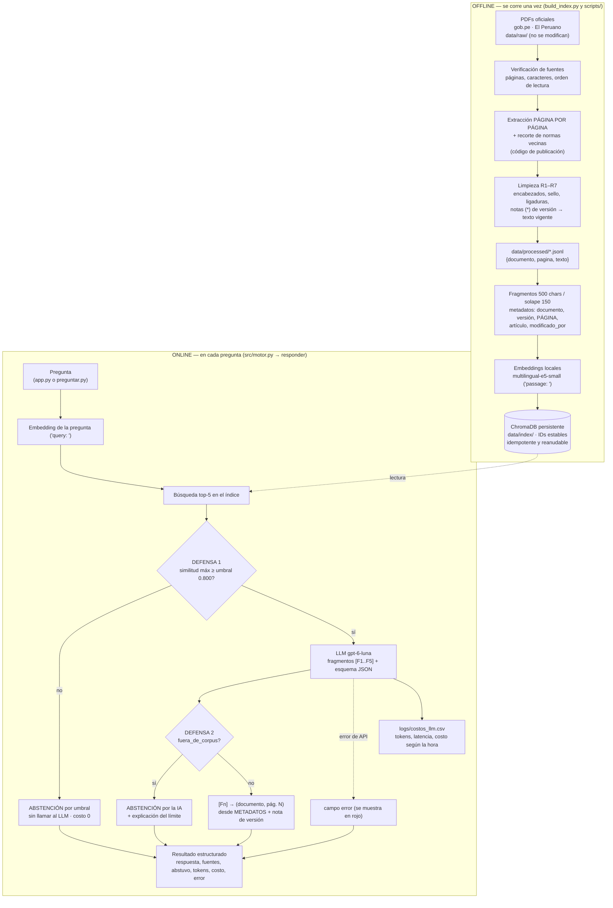
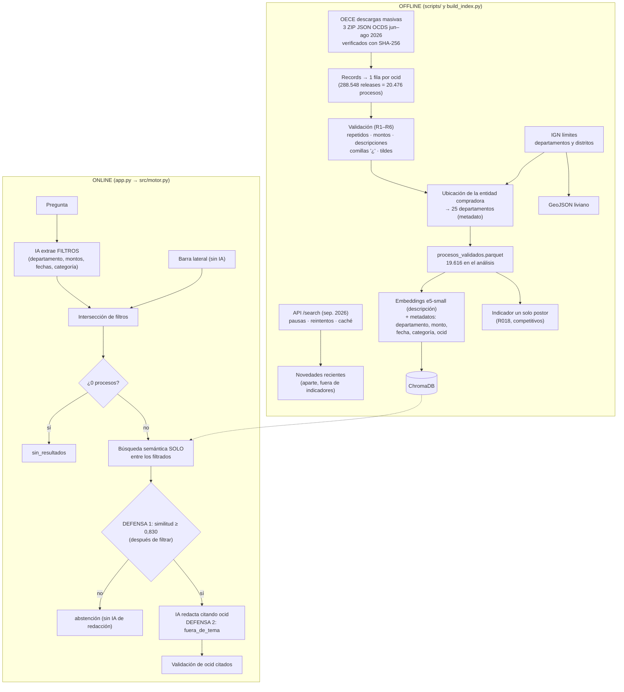

# Diagramas del pipeline (usados en el video)

## Tarea 1 — RAG normativo

```mermaid
flowchart TB
    subgraph OFF["OFFLINE — se corre una vez (build_index.py y scripts/)"]
        A["PDFs oficiales<br/>gob.pe · El Peruano<br/>data/raw/ (no se modifican)"] --> B["Verificación de fuentes<br/>páginas, caracteres, orden de lectura"]
        B --> C["Extracción PÁGINA POR PÁGINA<br/>+ recorte de normas vecinas<br/>(código de publicación)"]
        C --> D["Limpieza R1–R7<br/>encabezados, sello, ligaduras,<br/>notas (*) de versión → texto vigente"]
        D --> E["data/processed/*.jsonl<br/>{documento, pagina, texto}"]
        E --> F["Fragmentos 500 chars / solape 150<br/>metadatos: documento, versión, PÁGINA,<br/>artículo, modificado_por"]
        F --> G["Embeddings locales<br/>multilingual-e5-small ('passage: ')"]
        G --> H[("ChromaDB persistente<br/>data/index/ · IDs estables<br/>idempotente y reanudable")]
    end

    subgraph ON["ONLINE — en cada pregunta (src/motor.py → responder)"]
        Q["Pregunta<br/>(app.py o preguntar.py)"] --> R["Embedding de la pregunta ('query: ')"]
        R --> S["Búsqueda top-5 en el índice"]
        H -.lectura.-> S
        S --> T{"DEFENSA 1<br/>similitud máx ≥ umbral 0.800?"}
        T -- "no" --> U["ABSTENCIÓN por umbral<br/>sin llamar al LLM · costo 0"]
        T -- "sí" --> V["LLM gpt-6-luna<br/>fragmentos [F1..F5] + esquema JSON"]
        V --> W{"DEFENSA 2<br/>fuera_de_corpus?"}
        W -- "sí" --> X["ABSTENCIÓN por la IA<br/>+ explicación del límite"]
        W -- "no" --> Y["[Fn] → (documento, pág. N)<br/>desde METADATOS + nota de versión"]
        V -. "error de API" .-> Z["campo error (se muestra en rojo)"]
        Y --> OUT["Resultado estructurado<br/>respuesta, fuentes, abstuvo, tokens, costo, error"]
        U --> OUT
        X --> OUT
        Z --> OUT
        V --> LOG["logs/costos_llm.csv<br/>tokens, latencia, costo según la hora"]
    end
```

## Tarea 2 — Radar de compras

```mermaid
flowchart TB
    subgraph OFF["OFFLINE (scripts/ y build_index.py)"]
        A["OECE descargas masivas<br/>3 ZIP JSON OCDS jun–ago 2026<br/>verificados con SHA-256"] --> B["Records → 1 fila por ocid<br/>(288.548 releases = 20.476 procesos)"]
        A2["API /search (sep. 2026)<br/>pausas · reintentos · caché"] --> N["Novedades recientes<br/>(aparte, fuera de indicadores)"]
        B --> C["Validación (R1–R6)<br/>repetidos · montos · descripciones<br/>comillas '¿' · tildes"]
        IGN["IGN límites<br/>departamentos y distritos"] --> D
        C --> D["Ubicación de la entidad compradora<br/>→ 25 departamentos (metadato)"]
        D --> E["procesos_validados.parquet<br/>19.616 en el análisis"]
        E --> F["Embeddings e5-small (descripción)<br/>+ metadatos: departamento, monto,<br/>fecha, categoría, ocid"]
        F --> G[("ChromaDB")]
        E --> RI["Indicador un solo postor<br/>(R018, competitivos)"]
        IGN --> GJ["GeoJSON liviano"]
    end
    subgraph ON["ONLINE (app.py → src/motor.py)"]
        Q["Pregunta"] --> X["IA extrae FILTROS<br/>(departamento, montos, fechas, categoría)"]
        SB["Barra lateral (sin IA)"] --> Y
        X --> Y["Intersección de filtros"]
        Y --> Z{"¿0 procesos?"}
        Z -- sí --> SR["sin_resultados"]
        Z -- no --> S["Búsqueda semántica SOLO<br/>entre los filtrados"]
        G -.-> S
        S --> T{"DEFENSA 1: similitud ≥ 0,830<br/>(después de filtrar)"}
        T -- no --> AB["abstención (sin IA de redacción)"]
        T -- sí --> L["IA redacta citando ocid<br/>DEFENSA 2: fuera_de_tema"]
        L --> V["Validación de ocid citados"]
    end
```

