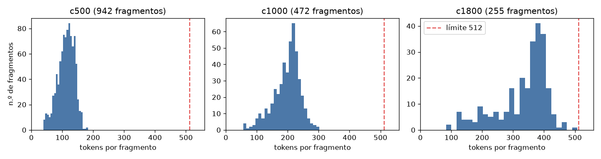

# Fragmentos e índice (Tarea 1, Fase 2)

Modelo local: `intfloat/multilingual-e5-small` (límite 512 tokens). Configuración elegida: **c500**.

## Comparación de configuraciones (eval/preguntas.csv, 15 preguntas dentro del corpus)

| Config. | Tamaño / solape (chars) | Fragmentos | Recall@1 | Recall@3 | Recall@5 | MRR@5 | Tokens mediana / máx. | Sobre el límite |
|---|---|---|---|---|---|---|---|---|
| c500 ✅ | 500 / 75 | 942 | 0.80 | 0.80 | 0.87 | 0.82 | 115 / 183 | 0 |
| c1000 | 1000 / 150 | 472 | 0.73 | 0.80 | 0.80 | 0.77 | 205 / 302 | 0 |
| c1800 | 1800 / 250 | 255 | 0.67 | 0.87 | 0.93 | 0.77 | 359 / 508 | 0 |

## Fragmentos por documento

| Documento | c500 | c1000 | c1800 |
|---|---|---|---|
| ley32069 | 619 | 307 | 168 |
| ds001_2026_ef | 303 | 154 | 81 |
| dl1715 | 20 | 11 | 6 |

## Distribución de longitudes

| Config. | chars mín / mediana / p90 / máx | tokens mín / mediana / p90 / máx |
|---|---|---|
| c500 | 65 / 415 / 565 / 575 | 39 / 115 / 144 / 183 |
| c1000 | 106 / 851 / 983 / 1149 | 56 / 205 / 245 / 302 |
| c1800 | 215 / 1570 / 1769 / 1998 | 83 / 359 / 409 / 508 |

Tokens = lo que realmente ve el modelo: prefijo `passage: ` + encabezado corto + texto.

